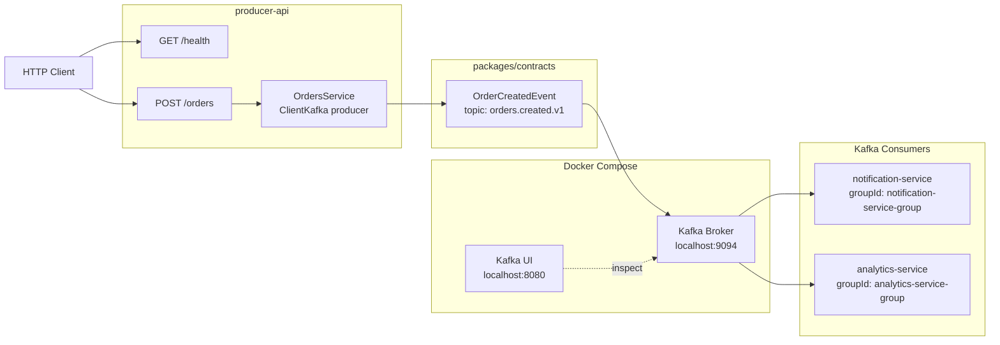
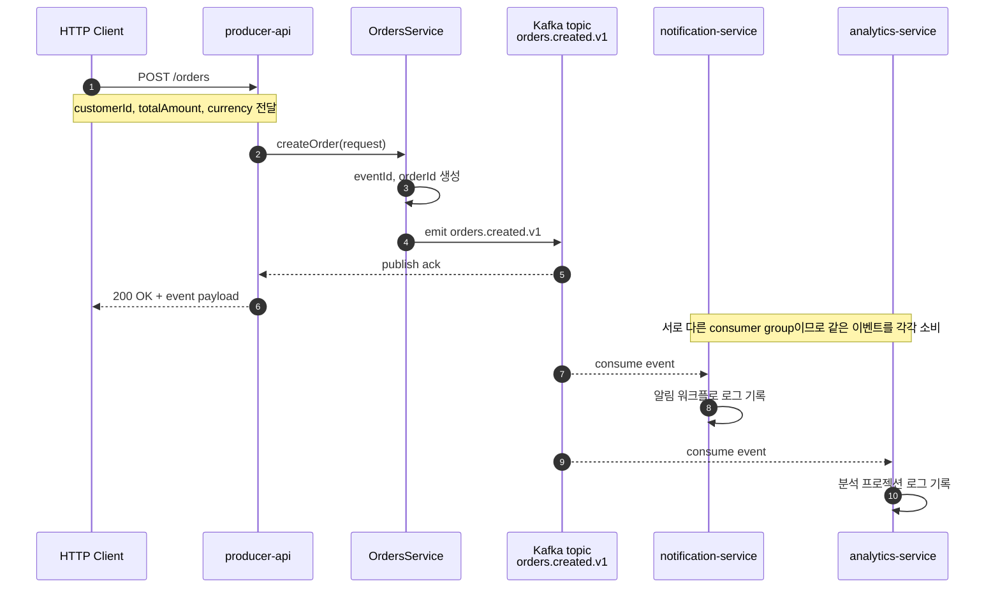
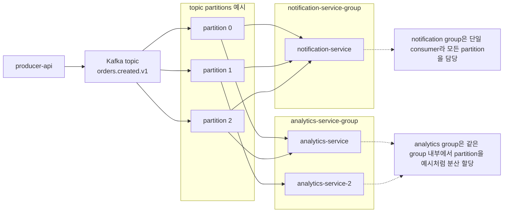
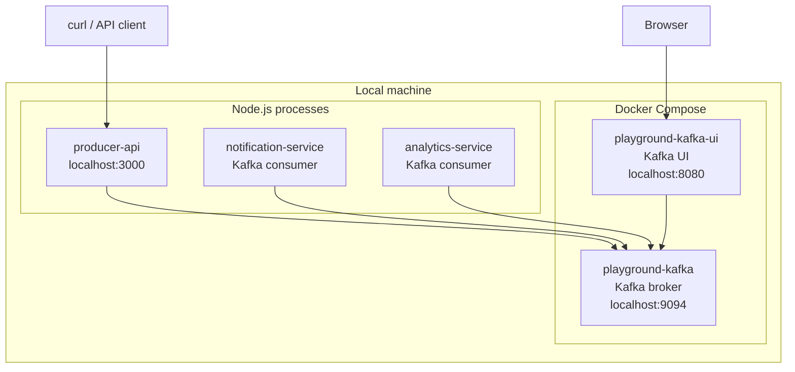
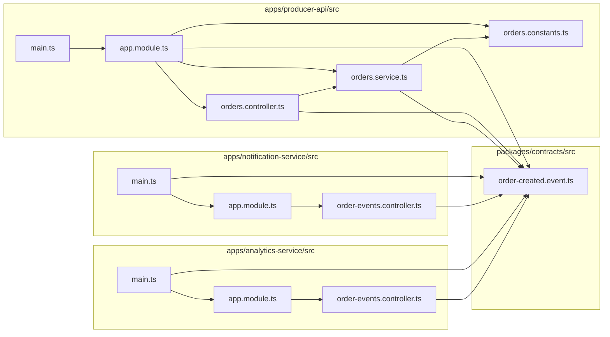

# NestJS Kafka Playground


NestJS와 TypeScript 기반으로 Kafka를 직접 만져보면서 EDA(Event-Driven Architecture) 흐름을 체험하기 위한 로컬 실습 프로젝트입니다.


- HTTP 요청이 들어오면 producer가 Kafka 토픽으로 이벤트를 발행합니다.

  ```mermaid
  graph LR
      Client((Client)) -- "HTTP Request" --> Producer["Producer Service"]
      Producer -- "Publish Event" --> Topic[("Kafka Topic")]
  ```

- 여러 consumer가 같은 이벤트를 각자 독립적으로 소비합니다.

  ```mermaid
  graph LR
      Topic[("Kafka Topic")] -- "Consume" --> ConsumerA["Consumer A"]
      Topic -- "Consume" --> ConsumerB["Consumer B"]
      Topic -- "Consume" --> ConsumerC["Consumer C"]
  ```

- 토픽, consumer group, fan-out, 분산 소비 같은 Kafka 기본 개념을 손으로 확인해봅니다.

  ```mermaid
  graph LR
      Topic[("Kafka Topic")]

      subgraph "Consumer Group A (Fan-out)"
          C_A1["Consumer A-1"]
      end

      subgraph "Consumer Group B (Distributed Consumption)"
          C_B1["Consumer B-1"]
          C_B2["Consumer B-2"]
      end

      Topic -- "Event" --> C_A1
      Topic -- "Event" --> C_B1
      Topic -- "Event" --> C_B2
  ```

- 이벤트 계약을 별도 패키지로 분리해서 NestJS에 종속되지 않는 구조를 연습합니다.

  ```mermaid
  graph TD
      Contract["Event Contract Package\n(Independent)"]

      subgraph "Producer Side"
          Producer["NestJS Producer"]
      end

      subgraph "Consumer Side"
          Consumer["NestJS Consumer"]
      end

      Contract -. "Imports" .-> Producer
      Contract -. "Imports" .-> Consumer
  ```

이 문서는 처음 실행하는 사람 기준으로 작성했습니다. 아래 순서대로 따라가면 로컬에서 Kafka를 띄우고, NestJS 서비스들을 실행하고, 이벤트를 발행하고, Kafka UI에서 메시지까지 확인할 수 있습니다.

## 1. 전체 구조

이 프로젝트에는 3개의 실행 서비스와 1개의 계약 패키지가 있습니다.

- `producer-api`
  - HTTP 요청을 받습니다.
  - `/orders`로 들어온 요청을 `orders.created.v1` 이벤트로 변환합니다.
  - Kafka에 이벤트를 발행합니다.
- `notification-service`
  - `orders.created.v1` 이벤트를 구독합니다.
  - "알림 워크플로를 시작했다"는 의미의 로그를 남깁니다.
- `analytics-service`
  - 같은 `orders.created.v1` 이벤트를 구독합니다.
  - "분석용 프로젝션을 갱신했다"는 의미의 로그를 남깁니다.
- `packages/contracts`
  - 토픽 이름과 이벤트 타입 정의를 한곳에 둡니다.
  - 나중에 producer나 consumer를 다른 런타임으로 바꿔도 이벤트 계약을 재사용하기 쉽게 만듭니다.

### 1-1. Mermaid 서비스 구조도



### 1-2. Mermaid 이벤트 흐름도



### 1-3. Mermaid consumer group scale-out 흐름도

아래 그림은 `analytics-service`를 같은 `groupId`로 하나 더 띄웠을 때 어떤 차이가 생기는지 보여줍니다.



이 다이어그램의 핵심은 아래와 같습니다.

- `notification-service-group`은 인스턴스가 하나뿐이라 해당 group이 맡는 모든 메시지를 한 프로세스가 처리합니다.
- `analytics-service-group`은 인스턴스가 둘이면 partition 할당 결과에 따라 메시지가 인스턴스 간 분산될 수 있습니다.
- 하지만 `notification-service-group`과 `analytics-service-group`은 서로 다른 group이므로 두 group 모두 같은 이벤트를 각자 받습니다.

### 1-4. Mermaid 로컬 실행 환경 배치도

아래 그림은 이 프로젝트를 로컬에서 실행할 때의 프로세스, 컨테이너, 포트 관계를 보여줍니다.



이 구조를 기준으로 보면:

- Node.js로 실행하는 Nest 서비스 3개와 Docker로 띄우는 Kafka 2개 컴포넌트가 분리되어 있습니다.
- `producer-api`는 HTTP로 이벤트를 발행합니다.
- consumer 둘은 Kafka를 소비하면서도 HTTP 상태 조회 포트를 함께 엽니다.
- Kafka UI는 브라우저에서 접속해 Kafka 내부 상태를 확인하는 관찰 도구 역할을 합니다.

### 1-5. Mermaid 소스 의존 관계도

아래 그림은 현재 소스 파일들이 어떤 방향으로 의존하는지 단순화해서 보여줍니다.



이 그림으로 읽을 수 있는 구조적 의미는 아래와 같습니다.

- 세 애플리케이션 모두 이벤트 계약을 직접 참조하지만, 서로의 구현 파일에는 의존하지 않습니다.
- 공통 계약이 `packages/contracts`에 있기 때문에 producer와 consumer가 느슨하게 연결됩니다.
- producer 내부에서는 `controller -> service -> Kafka client` 흐름이 있고, consumer 내부에서는 `main -> module -> event controller` 흐름이 있습니다.

## 2. 이 프로젝트로 배울 수 있는 것

이 예제를 통해 아래 내용을 바로 체감할 수 있습니다.

- Kafka producer가 어떻게 이벤트를 발행하는지
- 여러 consumer가 하나의 이벤트를 각자 처리하는 fan-out 느낌
- 서로 다른 `groupId`를 쓰면 같은 메시지를 각각 받는다는 점
- 같은 `groupId`를 쓰면 메시지가 group 내부에서 분산된다는 점
- 이벤트 이름을 버전 포함 토픽으로 관리하는 방식
- 이벤트 스키마를 애플리케이션 코드와 분리하는 기본 습관

### 2-1. Kafka 기본 개념과 용어

Kafka를 처음 볼 때는 용어가 한꺼번에 많이 나와서 헷갈릴 수 있습니다. 아래 표는 이 프로젝트를 기준으로 가장 자주 마주치는 개념을 정리한 것입니다.

| 용어 | 의미 | 이 프로젝트에서의 예시 |
| --- | --- | --- |
| `Broker` | 메시지를 저장하고 전달하는 Kafka 서버입니다. | Docker Compose로 띄운 Kafka 브로커가 `localhost:9094`로 열립니다. |
| `Topic` | 이벤트를 분류하는 논리적 채널입니다. Producer는 topic에 발행하고 consumer는 topic에서 읽습니다. | `orders.created.v1` |
| `Message` / `Record` | Kafka에 저장되는 실제 데이터 1건입니다. 보통 이벤트 payload가 여기에 들어갑니다. | `eventId`, `orderId`, `customerId`, `totalAmount`가 포함된 주문 생성 이벤트 |
| `Producer` | 메시지를 Kafka로 보내는 애플리케이션입니다. | `producer-api` |
| `Consumer` | Kafka에서 메시지를 읽어 처리하는 애플리케이션입니다. | `notification-service`, `analytics-service` |
| `Partition` | topic을 여러 조각으로 나눈 단위입니다. Kafka는 partition 단위로 저장과 분산 처리를 합니다. | 현재 Compose 설정은 topic 기본 partition 수를 `3`으로 둡니다. |
| `Offset` | partition 안에서 메시지의 순서를 나타내는 번호입니다. Consumer는 어디까지 읽었는지 offset으로 추적합니다. | 로그에 `partition=2 offset=0`처럼 표시됩니다. |
| `Consumer Group` | 여러 consumer를 하나의 논리적 소비 단위로 묶는 개념입니다. 같은 group 안에서는 메시지를 나눠 처리합니다. | `notification-service-group`, `analytics-service-group` |
| `Fan-out` | 하나의 이벤트를 여러 consumer group이 각자 받는 구조입니다. | notification group과 analytics group이 같은 이벤트를 각각 소비합니다. |
| `Distributed Consumption` | 같은 consumer group 안의 여러 consumer가 partition을 나눠 처리하는 방식입니다. | `analytics-service`를 같은 `groupId`로 여러 개 띄우는 실험 |
| `Event Contract` | 이벤트 이름과 payload 구조를 정의한 공통 약속입니다. Producer와 consumer가 같은 계약을 공유합니다. | `packages/contracts/src/order-created.event.ts` |
| `Consumer Lag` | topic에 쌓인 메시지 양과 consumer가 읽은 위치 사이의 차이입니다. lag가 크면 consumer가 밀리고 있다는 뜻입니다. | Kafka UI에서 group 상태를 볼 때 참고할 수 있습니다. |

이 프로젝트 흐름에 대입하면 아래처럼 이해하면 됩니다.

1. 클라이언트가 `producer-api`로 HTTP 요청을 보냅니다.
2. `producer-api`는 요청을 `orders.created.v1` topic의 message로 변환해서 Kafka broker에 발행합니다.
3. Kafka는 그 message를 topic의 특정 partition에 저장하고 offset을 부여합니다.
4. `notification-service-group`과 `analytics-service-group`은 서로 다른 consumer group이므로 같은 이벤트를 각각 받습니다.
5. 만약 같은 `groupId`를 쓰는 consumer 인스턴스를 여러 개 띄우면, 그 group 내부에서는 partition을 나눠서 분산 소비합니다.

처음에는 아래 네 가지만 확실히 잡아도 Kafka가 훨씬 쉽게 보입니다.

- `topic`: 이벤트가 들어가는 이름표
- `partition`: topic을 나눈 저장 단위
- `offset`: partition 안에서의 메시지 순번
- `consumer group`: 누가 메시지를 함께 나눠 처리할지 정하는 단위

## 3. 디렉터리 구조

```text
.
├── apps
│   ├── producer-api
│   ├── notification-service
│   └── analytics-service
├── packages
│   └── contracts
├── docker-compose.yml
├── package.json
└── README.md
```

조금 더 구체적으로 보면:

- `apps/producer-api/src`
  - HTTP 요청을 받아 이벤트를 발행하는 Nest 앱
- `apps/notification-service/src`
  - 이벤트를 소비하고 상태 조회 API를 여는 Nest 앱
- `apps/analytics-service/src`
  - 이벤트를 소비하고 집계 상태를 보여주는 Nest 앱
- `packages/contracts/src/order-created.event.ts`
  - 토픽 이름 `orders.created.v1`
  - 요청 타입 `CreateOrderRequest`
  - 이벤트 타입 `OrderCreatedEvent`

## 4. 사전 준비

아래 도구가 필요합니다.

- Node.js 22 이상 권장
- npm 10 이상 권장
- Docker
- Docker Compose

현재 프로젝트는 아래 포트를 사용합니다.

- `3000`: `producer-api`
- `3001`: `notification-service`
- `3002`: `analytics-service`
- `8080`: Kafka UI
- `9094`: Kafka 브로커 외부 접속 포트

이미 다른 프로세스가 이 포트를 점유하고 있으면 충돌할 수 있습니다.

## 5. 처음부터 실행하는 순서

### 5-1. 의존성 설치

저장소 루트에서 아래 명령을 실행합니다.

```bash
npm install
```

### 5-2. Kafka와 Kafka UI 실행

```bash
docker compose up -d
```

정상 실행 여부를 확인하고 싶다면:

```bash
docker compose ps
```

기대 상태는 대략 아래와 같습니다.

- `playground-kafka` 컨테이너가 `Up`
- `playground-kafka-ui` 컨테이너가 `Up`

Kafka UI는 브라우저에서 아래 주소로 접속할 수 있습니다.

```text
http://localhost:8080
```

### 5-3. TypeScript 빌드

이 프로젝트의 `start:*` 스크립트는 빌드된 결과물을 실행합니다. 따라서 먼저 빌드가 필요합니다.

```bash
npm run build
```

성공하면 `dist/` 디렉터리가 생성됩니다.

### 5-4. 서비스 3개 실행

터미널을 3개 열어서 각각 아래 명령을 실행합니다.

터미널 1:

```bash
npm run start:notification
```

터미널 2:

```bash
npm run start:analytics
```

터미널 3:

```bash
npm run start:producer
```

### 5-5. 서비스가 정상 기동했는지 확인

각 서비스에서 기대할 수 있는 핵심 로그는 아래와 같습니다.

`notification-service`

```text
Notification consumer is listening with group notification-service-group
Notification status API listening on http://localhost:3001/status
```

`analytics-service`

```text
Analytics consumer is listening with group analytics-service-group
Analytics status API listening on http://localhost:3002/status
```

`producer-api`

```text
Producer API listening on http://localhost:3000
Swagger UI available at http://localhost:3000/docs
Kafka brokers: localhost:9094
```

producer API는 health endpoint도 제공합니다.

```bash
curl http://localhost:3000/health
```

예상 응답:

```json
{
  "service": "producer-api",
  "status": "ok"
}
```

Swagger UI에서도 바로 테스트할 수 있습니다.

```text
http://localhost:3000/docs
```

`POST /orders`의 `Try it out` 버튼을 눌러 요청 본문을 넣고 실행하면, 같은 방식으로 Kafka 메시지를 발행할 수 있습니다.

consumer 둘도 상태 조회 endpoint를 제공합니다.

```bash
curl http://localhost:3001/status
```

```bash
curl http://localhost:3002/status
```

`notification-service`는 최근 예약된 알림 이벤트 목록을 보여주고, `analytics-service`는 통화별 누적 금액과 최근 프로젝션 갱신 내역을 보여줍니다.

## 6. 첫 이벤트 발행해보기

이제 producer API에 HTTP 요청을 보내서 Kafka 이벤트를 발생시켜 보겠습니다.

```bash
curl -X POST http://localhost:3000/orders \
  -H 'Content-Type: application/json' \
  -d '{"customerId":"customer-101","totalAmount":42000,"currency":"KRW"}'
```

예상 응답 예시는 아래와 비슷합니다.

```json
{
  "message": "Published orders.created.v1",
  "event": {
    "eventId": "29507ae8-663e-4ec4-9415-a854ec596218",
    "eventName": "orders.created.v1",
    "occurredAt": "2026-03-26T04:40:04.385Z",
    "orderId": "92c2e72c-044d-41f3-918d-63c1111c2f8b",
    "customerId": "customer-101",
    "totalAmount": 42000,
    "currency": "KRW"
  }
}
```

여기서 중요한 포인트는 다음과 같습니다.

- HTTP 요청은 동기식입니다.
- 하지만 실제 후속 처리 의도는 이벤트 기반으로 분리되어 있습니다.
- `producer-api`는 "주문 생성 이벤트를 발행한다"는 책임만 가집니다.
- `notification-service`와 `analytics-service`는 이벤트를 받아 각자의 관심사만 처리합니다.

## 7. 이벤트 발행 후 어떤 로그를 봐야 하나

이벤트가 정상적으로 흘렀다면 3개의 터미널에서 각각 아래와 비슷한 로그를 볼 수 있습니다.

`producer-api`

```text
Published orders.created.v1 for order=92c2e72c-044d-41f3-918d-63c1111c2f8b
```

`notification-service`

```text
Reserved notification flow for order=92c2e72c-044d-41f3-918d-63c1111c2f8b customer=customer-101 topic=orders.created.v1 partition=2 offset=0
```

`analytics-service`

```text
Updated analytics projection for order=92c2e72c-044d-41f3-918d-63c1111c2f8b amount=42000KRW topic=orders.created.v1 partition=2 offset=0
```

이 로그로 확인할 수 있는 사실은 아래와 같습니다.

- producer는 이벤트를 Kafka에 발행했습니다.
- 두 consumer는 같은 이벤트를 각각 받았습니다.
- 두 consumer는 서로 다른 `groupId`를 사용하므로 같은 메시지를 독립적으로 소비합니다.
- 메시지는 특정 partition과 offset을 가집니다.

로그 외에도 HTTP 상태 API로 소비 결과를 다시 확인할 수 있습니다.

`notification-service`

```bash
curl http://localhost:3001/status
```

예상 응답 예시:

```json
{
  "service": "notification-service",
  "status": "ok",
  "groupId": "notification-service-group",
  "processedCount": 1,
  "lastProcessedAt": "2026-03-27T01:20:00.000Z",
  "recentReservations": [
    {
      "eventId": "29507ae8-663e-4ec4-9415-a854ec596218",
      "orderId": "92c2e72c-044d-41f3-918d-63c1111c2f8b",
      "customerId": "customer-101",
      "topic": "orders.created.v1",
      "partition": 2,
      "offset": "0",
      "occurredAt": "2026-03-26T04:40:04.385Z",
      "reservedAt": "2026-03-27T01:20:00.000Z"
    }
  ]
}
```

`analytics-service`

```bash
curl http://localhost:3002/status
```

예상 응답 예시:

```json
{
  "service": "analytics-service",
  "status": "ok",
  "groupId": "analytics-service-group",
  "processedCount": 1,
  "lastProcessedAt": "2026-03-27T01:20:00.000Z",
  "totalsByCurrency": {
    "KRW": 42000,
    "USD": 0
  },
  "recentUpdates": [
    {
      "eventId": "29507ae8-663e-4ec4-9415-a854ec596218",
      "orderId": "92c2e72c-044d-41f3-918d-63c1111c2f8b",
      "totalAmount": 42000,
      "currency": "KRW",
      "topic": "orders.created.v1",
      "partition": 2,
      "offset": "0",
      "occurredAt": "2026-03-26T04:40:04.385Z",
      "projectedAt": "2026-03-27T01:20:00.000Z"
    }
  ]
}
```

## 8. 여러 이벤트를 연속으로 발행해보기

한 번만 보내보면 감이 덜 오기 때문에 여러 번 보내보는 것이 좋습니다.

예를 들어:

```bash
curl -X POST http://localhost:3000/orders \
  -H 'Content-Type: application/json' \
  -d '{"customerId":"customer-201","totalAmount":15000,"currency":"KRW"}'
```

```bash
curl -X POST http://localhost:3000/orders \
  -H 'Content-Type: application/json' \
  -d '{"customerId":"customer-202","totalAmount":31.5,"currency":"USD"}'
```

```bash
curl -X POST http://localhost:3000/orders \
  -H 'Content-Type: application/json' \
  -d '{"customerId":"customer-203","totalAmount":89000,"currency":"KRW"}'
```

보면서 확인할 포인트:

- `orderId`는 매번 달라집니다.
- `eventId`도 매번 달라집니다.
- partition은 메시지마다 달라질 수 있습니다.
- offset은 partition별로 증가합니다.

## 9. 요청 body는 어떻게 넣어야 하나

`POST /orders`는 아래 구조를 기대합니다.

```json
{
  "customerId": "customer-101",
  "totalAmount": 42000,
  "currency": "KRW"
}
```

필드 의미:

- `customerId`
  - 주문을 생성한 고객 식별자
  - 비워두면 서버가 임시 값으로 채웁니다
- `totalAmount`
  - 양수여야 합니다
  - `0` 이하이거나 숫자가 아니면 400 에러가 납니다
- `currency`
  - 현재는 `KRW` 또는 `USD`
  - `USD`가 아니면 기본적으로 `KRW`로 처리됩니다

잘못된 예:

```bash
curl -X POST http://localhost:3000/orders \
  -H 'Content-Type: application/json' \
  -d '{"customerId":"bad-case","totalAmount":0,"currency":"KRW"}'
```

이 경우 기대 결과:

- HTTP 400
- 메시지: `totalAmount must be a positive number`

## 10. Kafka UI에서 확인하는 방법

Kafka UI는 토픽과 메시지를 눈으로 보기 좋습니다.

주소:

```text
http://localhost:8080
```

들어가서 확인하면 좋은 순서는 아래와 같습니다.

1. 클러스터 `local` 선택
2. Topics 메뉴 진입
3. `orders.created.v1` 토픽 선택
4. 파티션 수가 3개인지 확인
5. 메시지 목록을 확인

확인 포인트:

- 토픽 이름이 `orders.created.v1`인지
- partition이 3개인지
- 방금 보낸 이벤트의 JSON payload가 들어왔는지
- consumer group이 생성되었는지

## 11. 왜 consumer 둘 다 같은 메시지를 받나

이 부분이 Kafka 입문에서 가장 중요한 지점 중 하나입니다.

현재 두 consumer는 서로 다른 group을 사용합니다.

- `notification-service-group`
- `analytics-service-group`

Kafka에서 consumer group은 "누가 같은 일을 나눠서 할 것인가"를 정의합니다.

즉:

- group이 다르면
  - 서로 다른 애플리케이션으로 취급됩니다
  - 같은 메시지를 각자 한 번씩 받습니다
- group이 같으면
  - 같은 애플리케이션 인스턴스 집합으로 취급됩니다
  - 메시지를 나눠서 처리합니다

지금 구조는 "알림 서비스도 필요하고 분석 서비스도 필요하다"는 상황을 표현한 예제이므로, 서로 다른 group을 사용해 fan-out 효과를 만들고 있습니다.

## 12. consumer group 분산 실험해보기

이제 조금 더 Kafka답게 실험해볼 수 있습니다.

### 12-1. 같은 group으로 consumer 여러 개 띄우기

예를 들어 analytics consumer를 하나 더 띄워봅니다.

먼저 빌드가 되어 있어야 합니다.

```bash
npm run build
```

새 터미널에서 아래처럼 실행합니다.

```bash
KAFKA_CLIENT_ID=analytics-service-2 \
KAFKA_GROUP_ID=analytics-service-group \
node dist/apps/analytics-service/src/main.js
```

이렇게 하면:

- 기존 `analytics-service`
- 새로 띄운 `analytics-service-2`

둘이 같은 group에 속하게 됩니다.

그 뒤 `/orders`에 여러 번 요청을 보내면 analytics 쪽 로그는 두 프로세스 사이에 분산될 수 있습니다.

확인 포인트:

- analytics 로그가 한 프로세스에만 몰리지 않고 나뉘는지
- consumer group 리밸런싱이 일어나는지

### 12-2. fan-out과 분산 소비를 비교해서 보기

현재 기본 상태:

- `notification-service-group`
- `analytics-service-group`

이때는:

- notification은 모든 이벤트를 받음
- analytics도 모든 이벤트를 받음

analytics를 같은 group으로 2개 띄우면:

- notification은 계속 모든 이벤트를 받음
- analytics group 내부에서는 메시지가 인스턴스끼리 나뉘어 처리됨

이 차이를 직접 보는 것이 Kafka 학습에 아주 좋습니다.

## 13. 실행 스크립트 설명

`package.json`에 정의된 주요 스크립트는 아래와 같습니다.

```bash
npm run build
```

- TypeScript를 `dist/`로 빌드합니다.

```bash
npm run start:producer
```

- 빌드된 producer API를 실행합니다.

```bash
npm run start:notification
```

- 빌드된 notification consumer를 실행합니다.

```bash
npm run start:analytics
```

- 빌드된 analytics consumer를 실행합니다.

```bash
npm run dev:producer
```

```bash
npm run dev:notification
```

```bash
npm run dev:analytics
```

- `tsx watch` 기반 개발용 스크립트입니다.
- 로컬 개발 환경에서는 편리하지만, 실행 환경에 따라 watch IPC 제약이 있을 수 있습니다.
- 가장 안정적으로 따라하려면 README의 기본 경로대로 `build -> start:*` 순서를 추천합니다.

## 14. 환경 변수

이 프로젝트에서 바로 써볼 수 있는 주요 환경 변수는 아래와 같습니다.

### 공통

- `KAFKA_BROKERS`
  - 기본값: `localhost:9094`
  - 여러 브로커를 쓰는 경우 쉼표로 구분할 수 있습니다

예시:

```bash
KAFKA_BROKERS=localhost:9094 npm run start:producer
```

### producer-api

- `PORT`
  - 기본값: `3000`

예시:

```bash
PORT=3100 npm run start:producer
```

### consumer 공통

- `PORT`
  - 기본값:
    - notification: `3001`
    - analytics: `3002`
- `KAFKA_CLIENT_ID`
  - 기본값:
    - notification: `notification-service`
    - analytics: `analytics-service`
- `KAFKA_GROUP_ID`
  - 기본값:
    - notification: `notification-service-group`
    - analytics: `analytics-service-group`

예시:

```bash
PORT=3101 \
KAFKA_CLIENT_ID=notification-local \
KAFKA_GROUP_ID=notification-service-group \
npm run start:notification
```

## 15. 실습을 더 재미있게 만드는 추천 시나리오

아래 순서로 해보면 Kafka 감각이 더 빨리 옵니다.

### 시나리오 A: 가장 기본 fan-out 확인

1. Kafka 실행
2. consumer 2개 실행
3. producer 실행
4. `/orders` 요청 1회 발행
5. 두 consumer가 모두 로그를 찍는지 확인

### 시나리오 B: 메시지 여러 개 발행

1. `/orders`를 5회 이상 호출
2. partition과 offset 변화를 관찰
3. Kafka UI에서 저장된 메시지를 확인

### 시나리오 C: 같은 group으로 scale-out 확인

1. analytics consumer를 하나 더 실행
2. 같은 `KAFKA_GROUP_ID`를 사용
3. 주문 이벤트 여러 개 발행
4. analytics group 내부에서 로그가 분산되는지 관찰

### 시나리오 D: 계약 중심 구조 보기

1. `packages/contracts/src/order-created.event.ts` 열기
2. topic 이름과 payload 타입 확인
3. producer와 consumer가 모두 이 계약을 참조하는지 확인

## 16. 현재 구현의 의도적인 단순화 포인트

이 예제는 학습용이라 일부러 단순하게 두었습니다.

- 데이터베이스가 없습니다
- 재시도 로직이 없습니다
- DLQ가 없습니다
- 스키마 레지스트리를 쓰지 않습니다
- 메시지 key를 별도로 주지 않습니다
- 정확히 한 번 처리 같은 고급 보장은 다루지 않습니다

즉, "Kafka와 EDA의 감을 익히는 첫 번째 실습"에 초점을 맞췄습니다.

## 17. 다음에 확장해볼 만한 주제

이 프로젝트를 기반으로 자연스럽게 확장할 수 있는 주제는 아래와 같습니다.

- 메시지 key를 `customerId` 또는 `orderId`로 넣어서 partitioning 보기
- `orders.created.v2` 토픽을 추가해서 버전 전략 실험
- 실패 이벤트를 DLQ 토픽으로 보내기
- retry/backoff 처리 넣기
- outbox 패턴 붙이기
- consumer에서 DB projection 저장하기
- saga/orchestration 대신 choreography 느낌으로 서비스 추가하기

## 18. 자주 겪는 문제와 해결법

### Kafka UI가 안 열릴 때

확인할 것:

- `docker compose ps`
- `playground-kafka-ui`가 `Up`인지
- 포트 `8080`이 다른 프로세스와 충돌하지 않는지

### producer가 Kafka에 연결되지 않을 때

확인할 것:

- `docker compose ps`
- `playground-kafka`가 `Up`인지
- `KAFKA_BROKERS`가 `localhost:9094`인지
- 로컬 방화벽 또는 포트 충돌이 없는지

### 이벤트를 보냈는데 consumer 로그가 안 찍힐 때

확인할 것:

- consumer 두 개가 먼저 떠 있었는지
- producer API가 정상 기동했는지
- `/orders` 호출이 200 응답을 받았는지
- Kafka UI에서 토픽과 메시지가 실제로 생성됐는지

### 포트 충돌이 있을 때

예를 들어 `3000`, `8080`, `9094` 중 하나가 이미 사용 중이면 충돌할 수 있습니다.

이럴 때는:

- 기존 프로세스를 정리하거나
- producer의 `PORT`를 변경하거나
- compose 파일 포트를 수정해서 사용합니다

## 19. 종료와 정리

실행 중인 Nest 프로세스는 각 터미널에서 `Ctrl+C`로 종료하면 됩니다.

Kafka와 Kafka UI까지 정리하려면:

```bash
docker compose down -v
```

`-v`를 붙이면 컨테이너뿐 아니라 관련 볼륨까지 함께 정리합니다.

## 20. 가장 짧은 실행 요약

시간이 없고 빠르게만 써보고 싶다면 아래 순서만 따라도 됩니다.

```bash
npm install
docker compose up -d
npm run build
```

터미널 1:

```bash
npm run start:notification
```

터미널 2:

```bash
npm run start:analytics
```

터미널 3:

```bash
npm run start:producer
```

이벤트 발행:

```bash
curl -X POST http://localhost:3000/orders \
  -H 'Content-Type: application/json' \
  -d '{"customerId":"customer-101","totalAmount":42000,"currency":"KRW"}'
```

확인:

- producer 로그 확인
- notification 로그 확인
- analytics 로그 확인
- Kafka UI `http://localhost:8080`에서 메시지 확인
